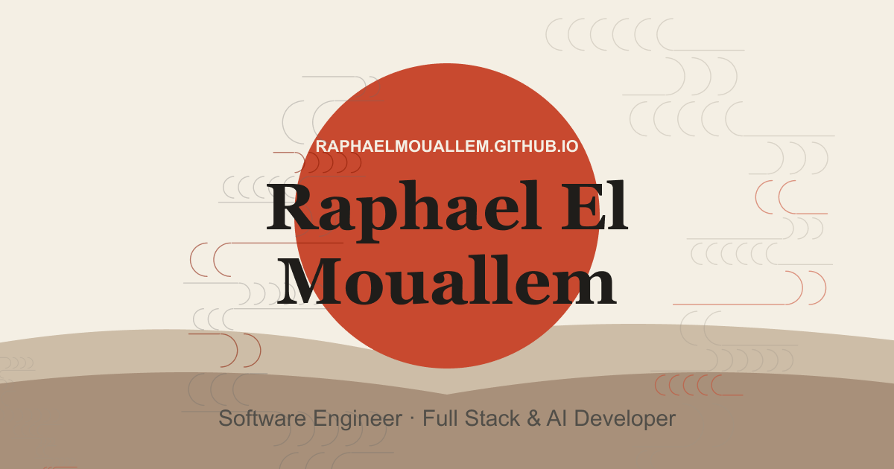

# raphaelmouallem.github.io



Personal portfolio — a scroll-driven freefall through a procedurally generated sky.

**Live:** https://raphaelmouallem.github.io

## Concept

The page opens in a room, looking up. Scrolling drops you into freefall — scroll speed controls fall speed, scroll up to rise back. Portfolio content (about, projects, contact) drifts past as cards while you fall, ending in an underwater scene at the bottom.

Two experiences ship from the same codebase:

- **Desktop** (`/`, `/3d`) — full 3D scene built with React Three Fiber, synthwave-themed
- **Mobile** (`/`, `/about`) — a lighter Japandi-style static layout, chosen automatically on mobile devices for WebGL reliability

Both share a terminal-style contact form (type `help` for available commands).

## Stack

- **React 19** + **Vite**
- **React Three Fiber** / **Three.js** — 3D scene
- **Framer Motion** — content cards, transitions
- **Zustand** — scene state
- **React Router** — device-based routing (`/`, `/3d`, `/about`)
- **Web3Forms** — contact form backend (no server)
- **GoatCounter** — privacy-friendly, cookieless analytics

## Running locally

```bash
npm install
npm run dev
```

Copy `.env.example` to `.env` and set `VITE_WEB3FORMS_ACCESS_KEY` to test the contact form locally.

## Build

```bash
npm run build
```

## Testing

```bash
npm run test:e2e
```

Runs a Playwright smoke + accessibility suite across Chromium, Firefox, WebKit, and mobile viewports.

## Deployment

Deploys automatically to GitHub Pages via GitHub Actions on every push to `main`.

## Links

- [GitHub](https://github.com/RaphaelMouallem)
- [LinkedIn](https://www.linkedin.com/in/raphael-el-mouallem-1qw/)
